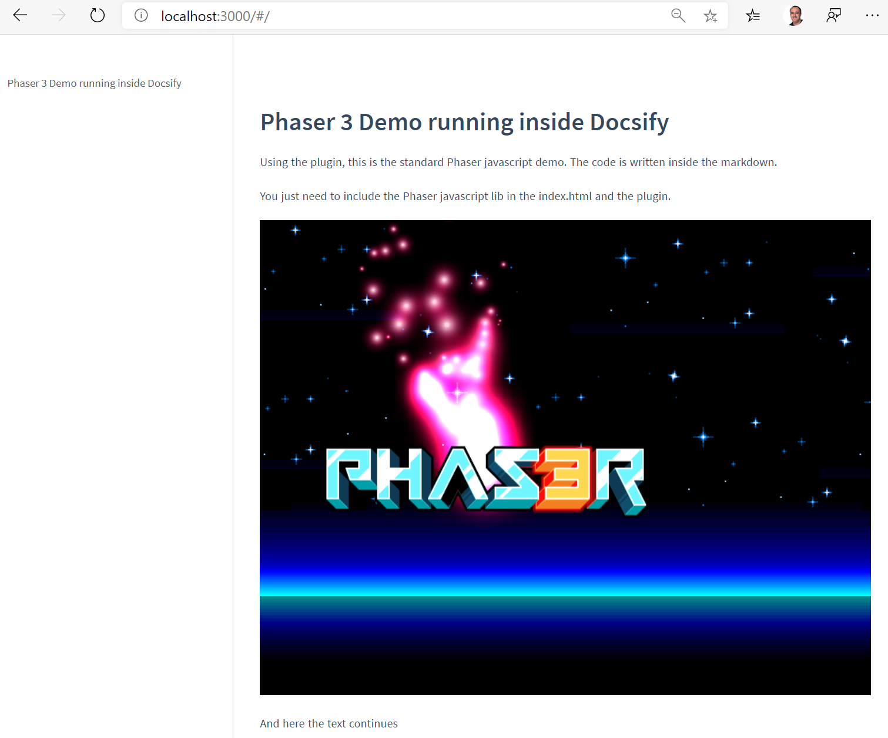

# Docsify Phaser Plugin

Run [Phaser](https://phaser.io) code directly from a [Docsify](https://docsify.js.org) MD file.



The markdown file is:

```
# Phaser 3 Demo running inside Docsify

Using the plugin, this is the standard Phaser javascript demo. The code is written inside the markdown.

You just need to include the Phaser javascript lib in the index.html and the plugin.

<!-- PHASER -->
    var config = {
        type: Phaser.AUTO,
        width: 800,
        height: 600,
        parent:'phaserapp',
        physics: {
            default: 'arcade',
    ...

    }
<!-- ENDPHASER -->

And here the text continues
```

## How to install

In the Docsify index.html include the Phaser and DocsifyPhaser plugin by adding two script references:

```html
    <!-- Phaser -->
    <script src="https://cdn.jsdelivr.net/npm/phaser@3.15.1/dist/phaser-arcade-physics.min.js"></script>
    <!-- DocsifyPhaser plugin -->
    <script src="docsifyPhaser.js"></script>
```

In the Phaser configuration you'll need to refer to the parent 'phaserapp'

```html
    var config = {
        ...
        parent:'phaserapp',
        ...
```

That's all.

## Try a demo

In the demo folder you'll find a complete sample.